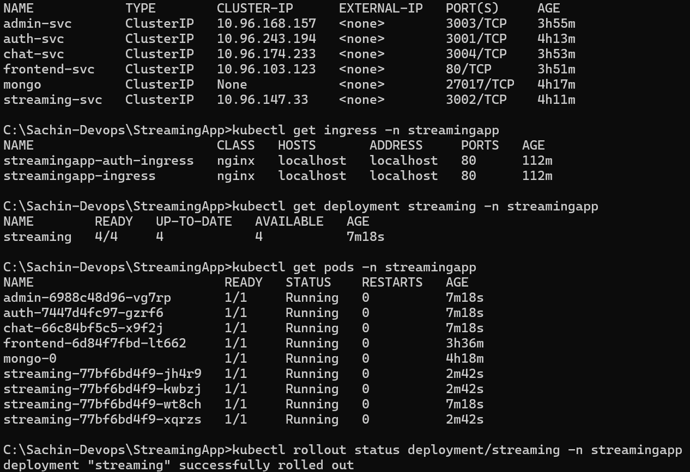
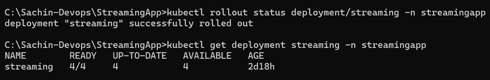
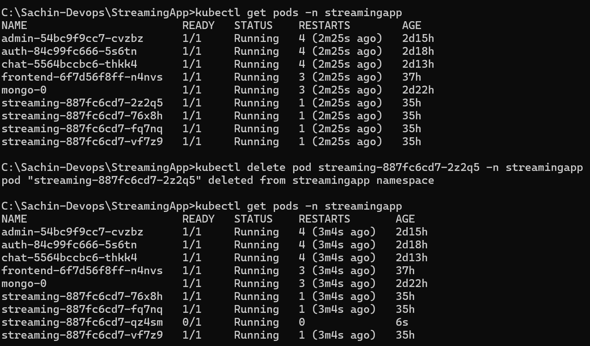

# StreamingApp — Container Orchestration and Scaling

A microservice-based video streaming application deployed using Docker, Kubernetes, Helm, and NGINX Ingress.

This project demonstrates containerization, Kubernetes orchestration, persistent MongoDB storage, service discovery, Ingress-based routing, horizontal scaling, rolling updates, and Kubernetes self-healing.

---

## 1. Application Architecture

StreamingApp consists of five application services and MongoDB:

| Component          |  Port | Purpose                                   |
| ------------------ | ----: | ----------------------------------------- |
| `authService`      |  3001 | User registration, authentication and JWT |
| `streamingService` |  3002 | Video catalogue and video streaming       |
| `adminService`     |  3003 | Video and thumbnail upload/administration |
| `chatService`      |  3004 | REST and WebSocket live chat              |
| `frontend`         |    80 | React application served through NGINX    |
| `mongo`            | 27017 | Persistent MongoDB database               |

### Kubernetes architecture

```text
                         Browser
                            |
                            | HTTP
                            v
                  +---------------------+
                  | NGINX Ingress       |
                  | Host: localhost     |
                  +----------+----------+
                             |
          +------------------+------------------+
          |          |          |        |       |
          v          v          v        v       v
     frontend    auth-svc  streaming  admin   chat
       :80        :3001      :3002    :3003   :3004
                             |
                    4 Streaming Pods
                             |
                             v
                       MongoDB :27017
                       StatefulSet
                             |
                            PVC
```

---

## 2. Docker Images

The application services were containerized and published to Docker Hub.

| Service   | Docker Image                        |
| --------- | ----------------------------------- |
| Auth      | `sacdew77/streaming-auth:1.0.0`     |
| Streaming | `sacdew77/streaming-stream:1.0.0`   |
| Admin     | `sacdew77/streaming-admin:1.0.0`    |
| Chat      | `sacdew77/streaming-chat:1.0.0`     |
| Frontend  | `sacdew77/streaming-frontend:1.0.0` |

Additional image versions were created during update testing, including `streaming-auth:1.0.1` and multiple frontend `1.0.x` versions.

---

## 3. Repository Structure

```text
StreamingApp/
├── backend/
│   ├── adminService/
│   ├── authService/
│   ├── chatService/
│   ├── streamingService/
│   └── common/
│
├── frontend/
│   ├── src/
│   ├── Dockerfile
│   └── nginx.conf
│
├── k8s/
│   └── streamingapp/
│       ├── namespace.yaml
│       ├── configmap.yaml
│       ├── secret.yaml
│       ├── auth-deployment.yaml
│       ├── streaming-deployment.yaml
│       ├── admin-deployment.yaml
│       ├── chat-deployment.yaml
│       ├── frontend-deployment.yaml
│       ├── mongo-statefulset.yaml
│       └── ingress.yaml
│
├── streamingapp/
│   ├── Chart.yaml
│   ├── values.yaml
│   ├── .helmignore
│   └── templates/
│       ├── auth.yaml
│       ├── streaming.yaml
│       ├── admin.yaml
│       ├── chat.yaml
│       ├── frontend.yaml
│       ├── mongo.yaml
│       ├── configmap.yaml
│       ├── secret.yaml
│       └── ingress.yaml
│
├── screenshots/
├── docker-compose.yml
├── .env.example
├── .gitignore
└── README.md
```

---

## 4. Kubernetes Deployment

The application is deployed into the `streamingapp` namespace.

### Create the namespace

```bash
kubectl apply -f k8s/streamingapp/namespace.yaml
```

### Deploy Kubernetes resources

```bash
kubectl apply -f k8s/streamingapp/
```

### Verify the deployment

```bash
kubectl get pods -n streamingapp
kubectl get svc -n streamingapp
kubectl get ingress -n streamingapp
```

All application pods should reach `Running` and `Ready` status.

---

## 5. MongoDB Persistence

MongoDB is deployed using a Kubernetes StatefulSet.

The configuration includes:

* MongoDB StatefulSet
* PersistentVolumeClaim
* Headless MongoDB service
* Persistent storage for database data

MongoDB is exposed internally on:

```text
27017
```

---

## 6. ConfigMap and Secret

Application configuration is managed using Kubernetes ConfigMap and Secret resources.

```text
k8s/streamingapp/configmap.yaml
k8s/streamingapp/secret.yaml
```

Sensitive values are not stored in the Git repository.

The `.gitignore` excludes local `.env` files and other environment-specific files.

---

## 7. Helm Deployment

The Kubernetes application is packaged as a Helm chart.

Chart location:

```text
streamingapp/
```

### Install the Helm chart

```bash
helm install streamingapp ./streamingapp
```

### Verify

```bash
helm list
kubectl get pods -n streamingapp
```

### Upgrade

For example:

```bash
helm upgrade streamingapp ./streamingapp --set services.auth.tag=1.0.1
```

---

## 8. Ingress

NGINX Ingress provides external access to the application.

The configured host is:

```text
http://localhost
```

The following paths are routed internally:

| Path             | Kubernetes Service   |
| ---------------- | -------------------- |
| `/`              | `frontend-svc:80`    |
| `/api/auth`      | `auth-svc:3001`      |
| `/api/streaming` | `streaming-svc:3002` |
| `/api/admin`     | `admin-svc:3003`     |
| `/api/chat`      | `chat-svc:3004`      |
| `/socket.io`     | `chat-svc:3004`      |

Open the application in a browser:

```text
http://localhost
```

---

## 9. Horizontal Scaling

The Streaming service was scaled from one replica to four replicas.

Command:

```bash
kubectl scale deployment/streaming --replicas=4 -n streamingapp
```

Verification:

```bash
kubectl get deployment streaming -n streamingapp
```

Expected result:

```text
NAME        READY   UP-TO-DATE   AVAILABLE
streaming   4/4     4            4
```

The four streaming pods provide multiple backend instances behind the Kubernetes Service.

### Scaling Evidence



---

## 10. Rolling Updates

The Deployments use the Kubernetes rolling-update strategy:

```yaml
strategy:
  type: RollingUpdate
  rollingUpdate:
    maxUnavailable: 0
    maxSurge: 1
```

This configuration ensures that existing available pods are maintained while new pods are created during an update.

### Rollout verification

```bash
kubectl rollout status deployment/streaming -n streamingapp
```

Successful verification:

```text
deployment "streaming" successfully rolled out
```

Current deployment state:

```text
READY   UP-TO-DATE   AVAILABLE
4/4     4            4
```

### Rolling Update Evidence



---

## 11. Kubernetes Self-Healing

Kubernetes automatically recreates failed or deleted pods managed by a Deployment.

A streaming pod was intentionally deleted during testing:

```bash
kubectl delete pod <streaming-pod-name> -n streamingapp
```

Kubernetes automatically created a replacement pod.

The replacement pod reached:

```text
1/1 Running
```

This verifies the self-healing capability of the Kubernetes Deployment.

### Self-Healing Evidence



---

## 12. Application Verification

The following application functionality was verified:

### Application access

The application is accessible through the Kubernetes Ingress:

```text
http://localhost
```

### Authentication

User registration and login functionality was tested through the frontend.

### Video upload

The admin functionality was tested for uploading video and thumbnail assets.

### Video playback

Video playback was successfully verified through the streaming service.

HTTP range requests are supported by the streaming endpoint, allowing partial-content responses for video playback.

### Live chat

The live chat functionality was tested using multiple browser sessions/tabs.

---

## 13. Verification Commands

### All Kubernetes resources

```bash
kubectl get pods,svc,ingress -A
```

### Application pods

```bash
kubectl get pods -n streamingapp
```

### Services

```bash
kubectl get svc -n streamingapp
```

### Ingress

```bash
kubectl get ingress -n streamingapp
```

### Deployments

```bash
kubectl get deployments -n streamingapp
```

### Streaming rollout

```bash
kubectl rollout status deployment/streaming -n streamingapp
```

---

## 14. Screenshots and Evidence

Selected implementation and verification evidence is available in the `screenshots/` directory.

Important evidence includes:

* Docker images
* Dockerfiles
* Kubernetes pods and services
* Kubernetes deployments
* Helm deployment
* Ingress configuration
* Application login
* Video playback
* Four streaming replicas
* Rolling update
* Kubernetes self-healing
* Application smoke tests

---

## 15. Docker Compose

The application can also be run using Docker Compose for local development.

```bash
docker-compose up --build
```

The traditional local frontend is available at:

```text
http://localhost:3000
```

For the Kubernetes deployment, use the Ingress endpoint:

```text
http://localhost
```

---

## 16. Production Considerations

For production deployment, the following improvements are recommended:

* Use HTTPS/TLS for the Ingress.
* Store secrets in a dedicated secret-management solution such as AWS Secrets Manager or an external secrets operator.
* Use managed MongoDB or a production-grade replicated database.
* Configure resource requests and limits for all workloads.
* Add Horizontal Pod Autoscaling based on CPU/memory or application metrics.
* Use a production object-storage/CDN configuration for video delivery.
* Configure centralized logging and monitoring.
* Configure readiness and liveness probes appropriately.
* Use separate Kubernetes namespaces/environments for development, staging and production.
* Implement CI/CD for automated image builds, security scanning and Helm deployments.

---

## 17. Technologies Used

* React
* Node.js
* Express
* MongoDB
* Docker
* Kubernetes
* Helm
* NGINX
* NGINX Ingress Controller
* WebSockets / Socket.IO
* AWS S3
* GitHub
* Docker Hub

---

## 18. Assignment Verification Summary

| Requirement                   | Status    |
| ----------------------------- | --------- |
| Containerization              | Completed |
| Kubernetes Deployments        | Completed |
| Kubernetes Services           | Completed |
| MongoDB StatefulSet           | Completed |
| Persistent storage            | Completed |
| ConfigMap / Secret            | Completed |
| Health probes                 | Completed |
| Helm chart                    | Completed |
| Ingress routing               | Completed |
| Horizontal scaling            | Completed |
| Rolling updates               | Completed |
| Self-healing                  | Completed |
| Video playback                | Verified  |
| Application smoke testing     | Verified  |
| Documentation and screenshots | Included  |

---
